# End-to-End Fiori App Delivery 

## 1. Geração do BSP

## 2. Deploy da Aplicação

## 3. Criação dos Descritores da Aplicação

## 4. Configuração das IAM Apps

## 5. Configuração do Launchpad

## 6. Configuração do Catálogo de Negócio

## 7. Publicação no Launchpad

## 8. Validação End-to-End

## 1. Geração do BSP

### Objetivo

A geração do BSP tem como objetivo empacotar e disponibilizar os artefatos da aplicação Fiori no repositório do servidor ABAP.

Essa etapa é necessária para que a aplicação Fiori possa ser posteriormente configurada, vinculada aos recursos de segurança e navegação (IAM Apps, catálogos e Launchpad) e disponibilizada aos usuários finais.    

A geração do BSP pelo VS Code é mais adequada do que pelo Eclipse/ADT quando o objetivo é automatizar o processo de entrega de uma aplicação Fiori, principalmente por permitir uma abordagem mais orientada a arquivos.

### Passo a Passo

1- Selecione "CREATE A SAP FIORI APP".
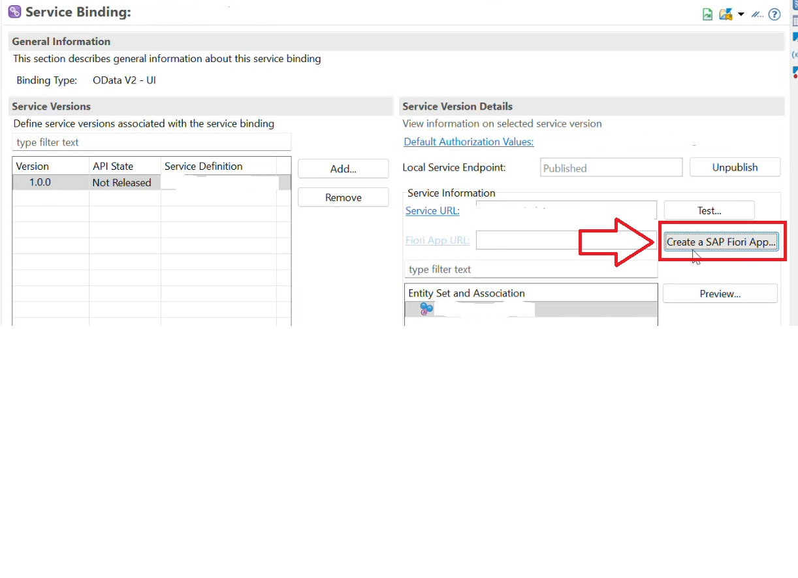

2- Selecione "Configure a external IDE".
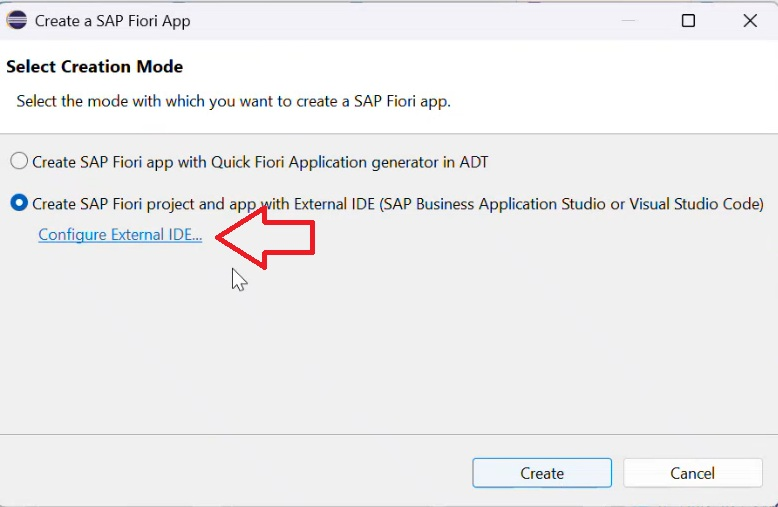

3- Selecione "Visual Studio Code" , clicar em create.
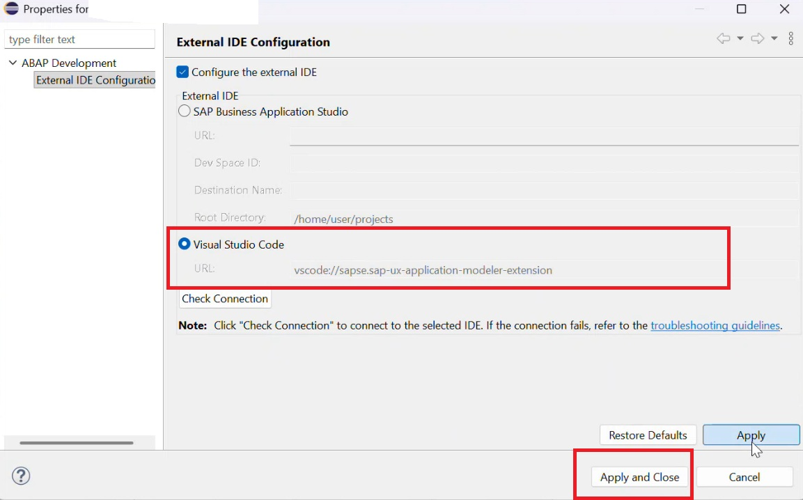

4- Selecione a entidade correspondente , clicar em create.
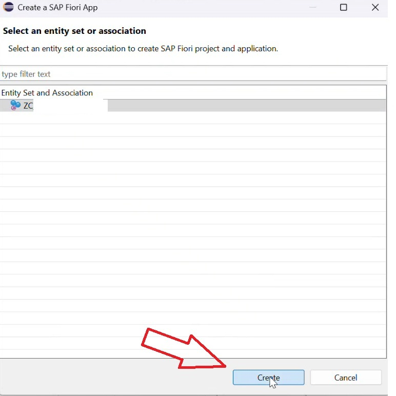

5- Configure o servidor de conexão.

Connection Name : Nome da Conexão que será armazenada na IDE.

URL: link de conexão do ambiente public cloud.

Clique em Test connection , após validar clicar em create.
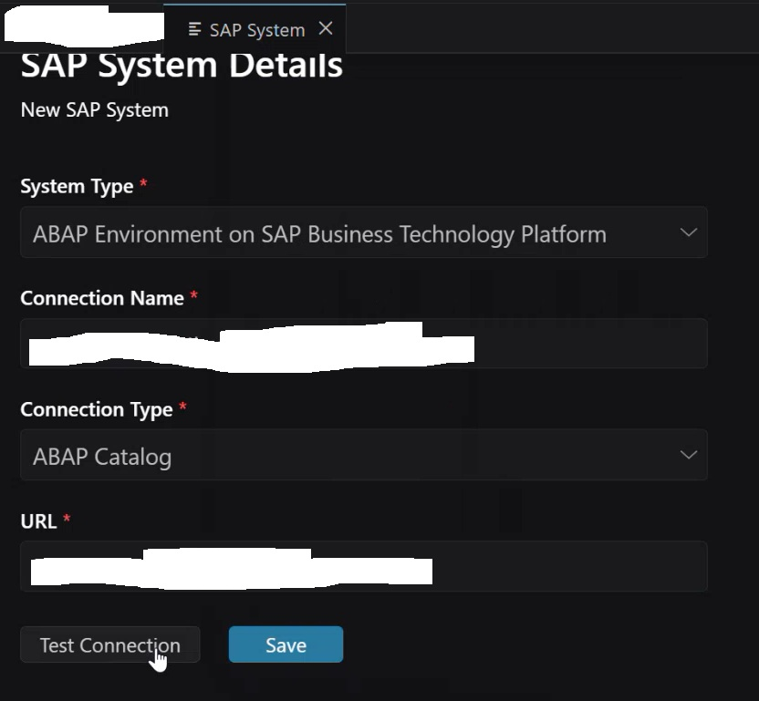

6- SAP Fiori Generator.

É o modelo mais usado para aplicações empresariais SAP.

Você fornece uma fonte de dados, normalmente um serviço OData, e o Fiori elements gera grande parte da interface com base em metadados e anotações.

Os principais floorplans são:

List Report — para listar e pesquisar registros.
Object Page — para visualizar/editar os detalhes de um registro.
Analytical List Page (ALP) — para análise de dados com gráficos, filtros e tabelas.
Overview Page (OVP) — para dashboards com vários cards.
Worklist — para listas de trabalho/processamento.

Selecione o modelo e clique em NEXT.

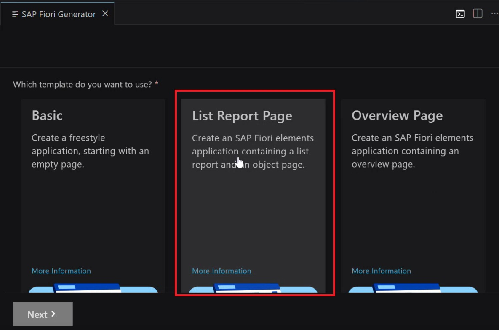

7 - Main entity.

Selecione a main entity e o Table type clique em NEXT.

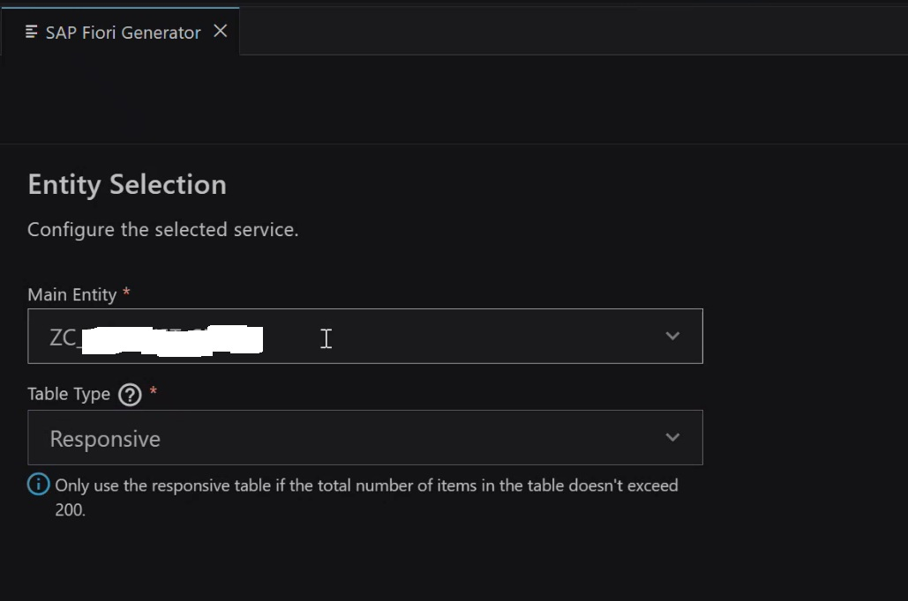

8- Project Attributes.
7
Module Name - Nome do contexto de desenvolvimento separado por '.' 
Ex: meudesenvolvimento.cadastro

Applitaction title - Titulo do desenvolvimento.

Description - Descrição do desenvolvimento.

Project folder... -  Pasta 'FIORI' Separada por projeto.

Minimum SAP Version -  Sempre escolher (source system version).

Sobre os checkbox's não precisa alterar nada, no próximo passo iremos configurar o deploy.

Clicar em Finish

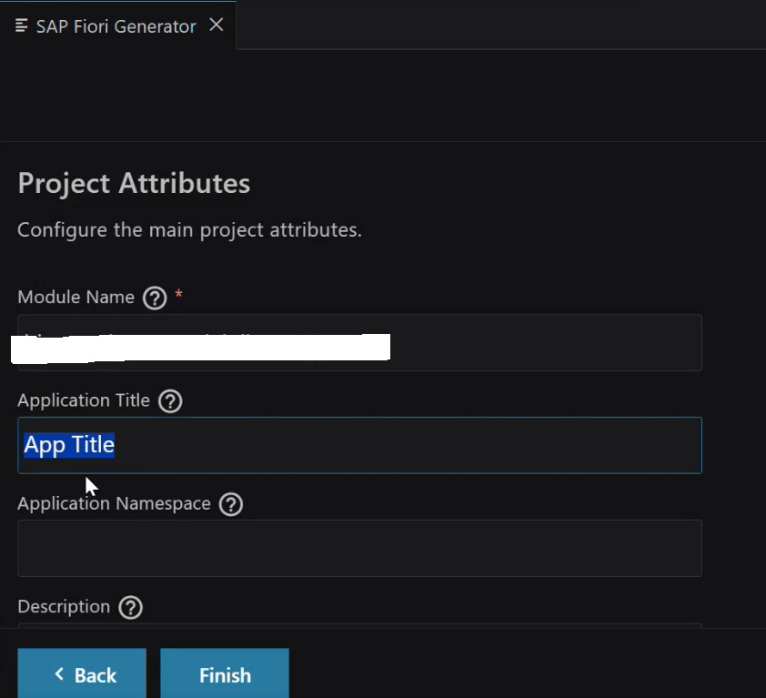

9 - Project Attributes.

Clicar em Add for deploy

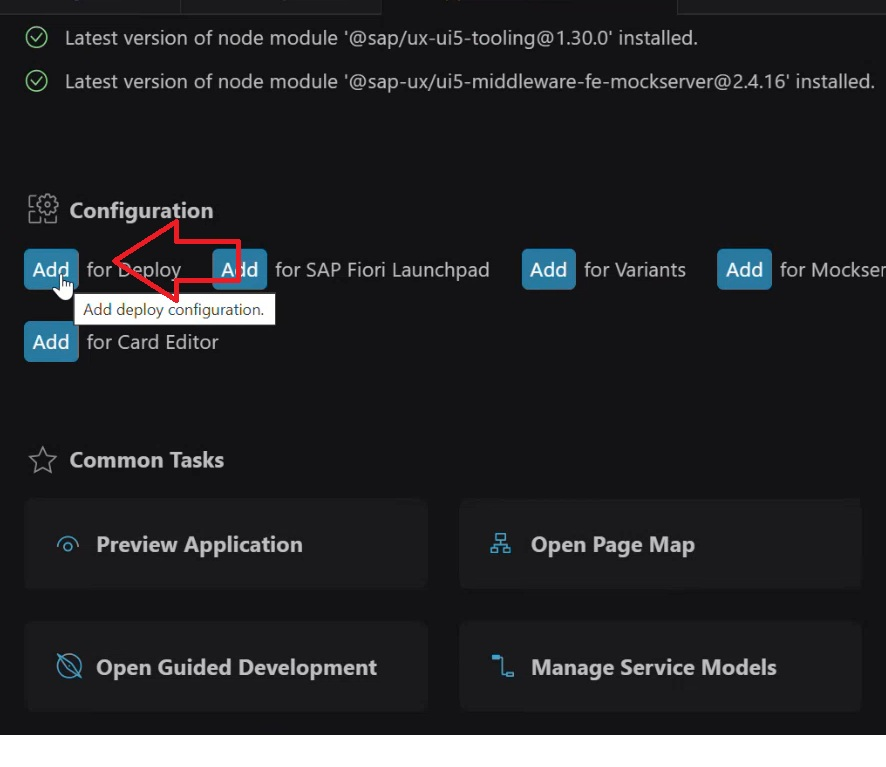

10 - Deployment configuration Generator.

Select Target System - Sistema SAP cadastrado anteriormente.

SAPUI5 abap Repository - nome do seu BSP ex: ZUX_NOME_DA_DEMANDA

Select How you want ... package - Definir como será encontrado o pacote que irá salvar o BSP.
Escolher : Choose From Existing.

Package: Selecionar o pacote que foi desenvolvimento o seu desenvolvimento.

Select How you want ... Transport Request - Definir como será encontrado a request que irá salvar o BSP.
     
Escolher : Choose From Existing.

Irá automaticamente selecionar a request que está armazenada o desenvolvimento.

Clicar em FINISH.

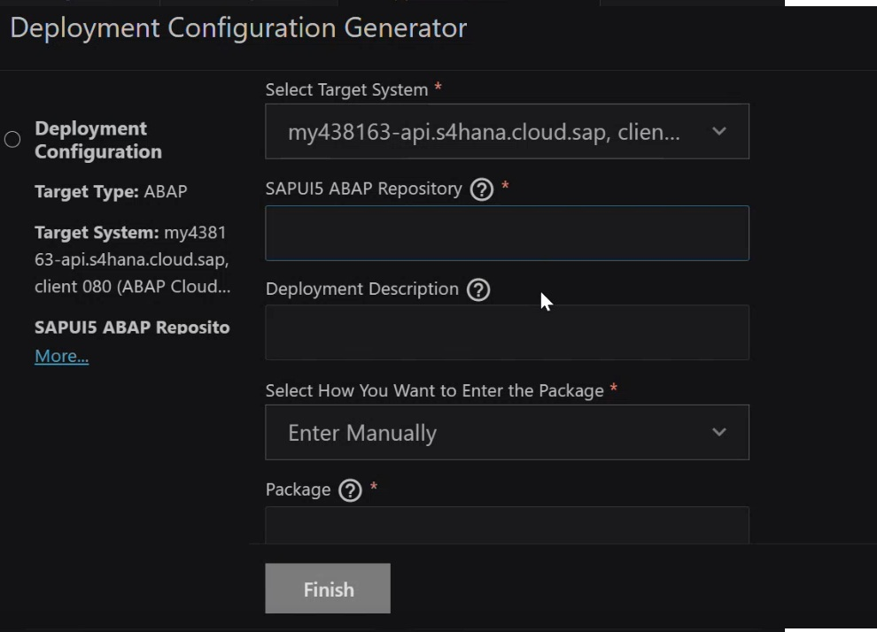

11 - Abrir o Terminal .

digitar: "npm run deploy"

Irá pedir a confirmação: Basta digitar Y.

Ao final aparecerá que o deploy ocorreu com sucesso.

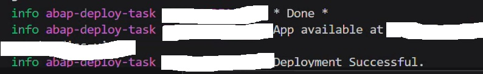

