End-to-End Fiori App Delivery

Etapas do Processo

1. Geração do BSP

2. Deploy da Aplicação

3. Criação dos Descritores da Aplicação

4. Configuração das IAM Apps

5. Configuração do Launchpad

6. Configuração do Catálogo de Negócio

7. Publicação no Launchpad


1.  Geração do BSP

Objetivo

A geração do BSP tem como objetivo empacotar e disponibilizar os artefatos da aplicação Fiori no repositório do servidor ABAP.

Essa etapa é necessária para que a aplicação Fiori possa ser posteriormente configurada, vinculada aos recursos de segurança e navegação (IAM Apps, catálogos e Launchpad) e disponibilizada aos usuários finais.    

A geração do BSP pelo VS Code é mais adequada do que pelo Eclipse/ADT quando o objetivo é automatizar o processo de entrega de uma aplicação Fiori, principalmente por permitir uma abordagem mais orientada a arquivos.

📝 Passo a Passo

1. CREATE A SAP FIORI APP

Selecione "CREATE A SAP FIORI APP".

<p *align*="center">

  

</p>

2. Configure a external IDE

Selecione "Configure a external IDE".

<p *align*="center">

  

</p>

3. Visual Studio Code

Selecione "Visual Studio Code", clicar em create.

<p *align*="center">

  

</p>

4. Entidade

Selecione a entidade correspondente, clicar em create.

<p *align*="center">

  

</p>

5. Configure o servidor de conexão

Configure o servidor de conexão.

Connection Name: Nome da Conexão que será armazenada na IDE.

URL: link de conexão do ambiente public cloud.

Ação: Clique em Test connection, após validar clicar em Create.

<p *align*="center">

  

</p>

6. SAP Fiori Generator

É o modelo mais usado para aplicações empresariais SAP.

Você fornece uma fonte de dados, normalmente um serviço OData, e o Fiori elements gera grande parte da interface com base em metadados e anotações.

Os principais floorplans são:

- List Report — para listar e pesquisar registros.

- Object Page — para visualizar/editar os detalhes de um registro.

- Analytical List Page (ALP) — para análise de dados com gráficos, filtros e tabelas.

- Overview Page (OVP) — para dashboards com vários cards.

- Worklist — para listas de trabalho/processamento.

Ação: Selecione o modelo e clique em NEXT.

<p *align*="center">

  

</p>

7. Main entity

Selecione a main entity e o Table type clique em NEXT.

<p *align*="center">

  

</p>

8. Project Attributes

Module Name — Nome do contexto de desenvolvimento separado por '.'

Ex: `meudesenvolvimento.cadastro`

Applitaction title — Titulo do desenvolvimento.

Description — Descrição do desenvolvimento.

Project folder... — Pasta 'FIORI' Separada por projeto.

Minimum SAP Version — Sempre escolher (source system version).

Sobre os checkbox's não precisa alterar nada, no próximo passo iremos configurar o deploy.

Ação: Clicar em Finish

<p *align*="center">

  

</p>

9. Project Attributes

Ação: Clicar em Add for deploy

<p *align*="center">

  

</p>

10. Deployment configuration Generator

Select Target System — Sistema SAP cadastrado anteriormente.

SAPUI5 abap Repository — nome do seu BSP.

Ex: `ZUX_NOME_DA_DEMANDA`

Select How you want ... package — Definir como será encontrado o pacote que irá salvar o BSP.

Escolher:

Choose From Existing.

Package: Selecionar o pacote que foi desenvolvimento o seu desenvolvimento.

Select How you want ... Transport Request — Definir como será encontrado a request que irá salvar o BSP.

Escolher:

Choose From Existing.

Irá automaticamente selecionar a request que está armazenada o desenvolvimento.

Ação: Clicar em FINISH.

<p *align*="center">

  

</p>

11. Abrir o Terminal

digitar:

```bash

npm run deploy

<p align="center">

  

</p>

### 12. Criar o descriptor

digitar:

Launchpad App Descriptor Item

oque é ? É o “cadastro” da aplicação dentro do Launchpad, contendo informações que permitem ao Launchpad saber qual app abrir, qual título/ícone exibir e como o usuário acessará a aplicação.

 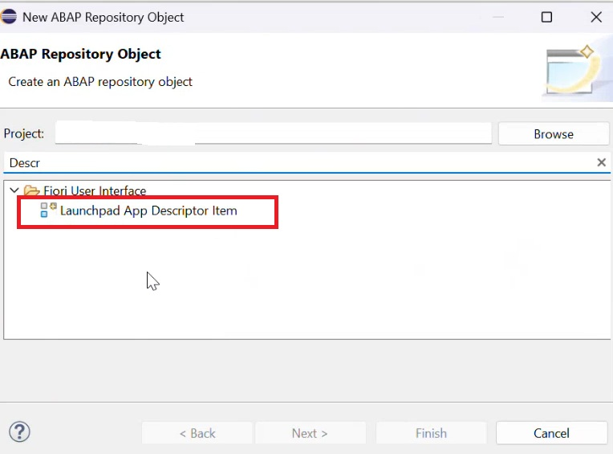

 ### 13. Configuração do descriptor

name: Prefixo ZDSC_nome_demanda

Description: Descriptor - Descrição do aplicativo.

AppType:  SAPUI5 Fiori Application

SAPUI5ComponentID: Nome do project name criado no vscode no nosso exemplo( meudesenvolvimento.cadastro ).

SemanticObject: Nome do aplicativo em CamelCase ex: MeuAplicativo.

action: Manage.

Ação: Next.

Launchpad App Descriptor Item

 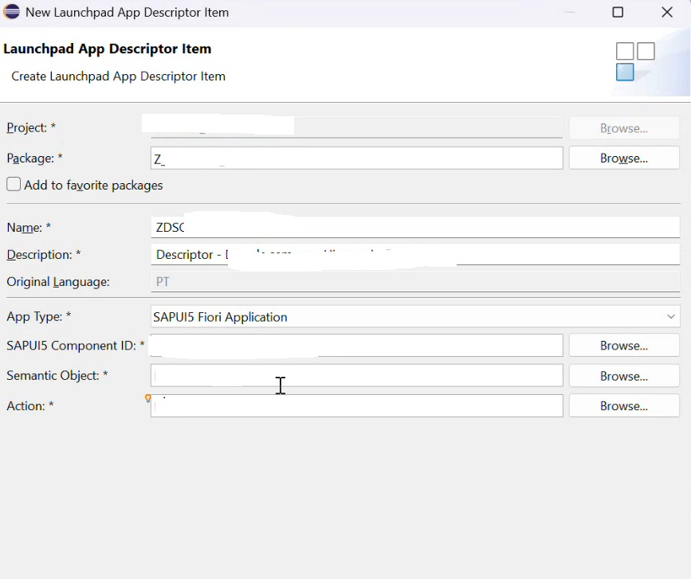

### 14. Configuração do Descriptor

Ao descer um pouco a janela será possivel clicar em add, dessa forma será aberta a segunda janela.

Em Tile Details Configurar:

Title: Titulo da aplicação.

Subtitle: Subtitulo da aplicação.

Icon: visitar o site https://ui5.sap.com/test-resources/sap/m/demokit/iconExplorer/webapp/index.html#/overview e escolher um ícone que irá ilustrar o seu App no launchpad.

Ativar o descritor.

Launchpad App Descriptor Item

 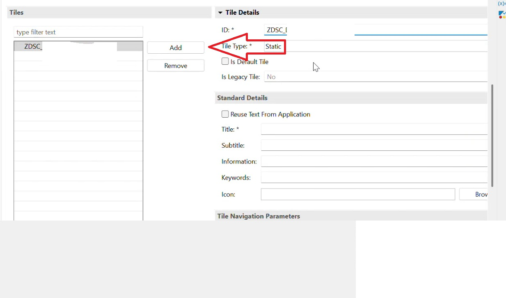

### 14. Criação do IAM App

No contexto SAP, IAM App significa uma aplicação relacionada ao Identity and Access Management (IAM) — gerenciamento de identidades e acessos.

Resumindo:
É uma aplicação utilizada para controlar quem é o usuário, como ele se autentica e quais recursos/aplicações ele pode acessar.

Name: ZIAM_NOME_DO_APP_UI

Description: IAM App - Descrição do app

ApplicationType: App externo

Ação: Clicar em Next/Finish

 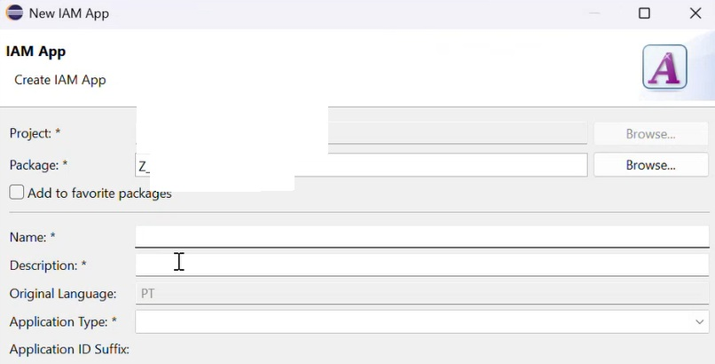

### 15. Configuração do IAM App

Em Fiori Launchpad App Descr Item ID: colocar o nome do descriptor criado anteriormente.

Na sequencia vincular ele a um catálogo de negócios.

Ação: Clicar em Create a new Business...

Ação: Clicar em Next/Finish

 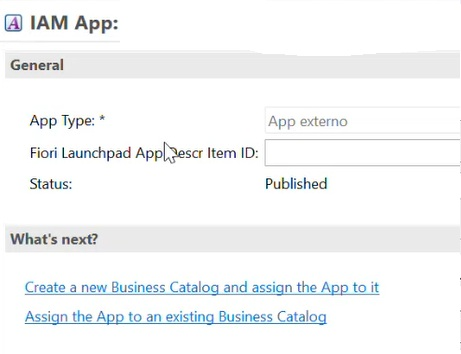

### 16. Configuração do IAM App

Em Fiori Launchpad App Descr Item ID: colocar o nome do descriptor criado anteriormente.

Na sequencia vincular ele a um catálogo de negócios.

Ação: Clicar em Create a new Business... e depois vincular ele ao IAM em assign business...

Ação: Clicar em Next/Finish


### 17. Criação do Business Catalog

No SAP Fiori / S/4HANA, um Business Catalog (Catálogo de Negócios) é um agrupamento de aplicações e objetos de autorização que define quais funcionalidades podem ser disponibilizadas para um usuário.

Resumindo:
Business Catalog = conjunto de apps/funcionalidades que uma determinada função de negócio pode acessar.

Name: ZCAT_Nome_demanda.

Description: Catálogo de desenvolvimento nomedemanda.

Ação: Clicar em Next/Finish

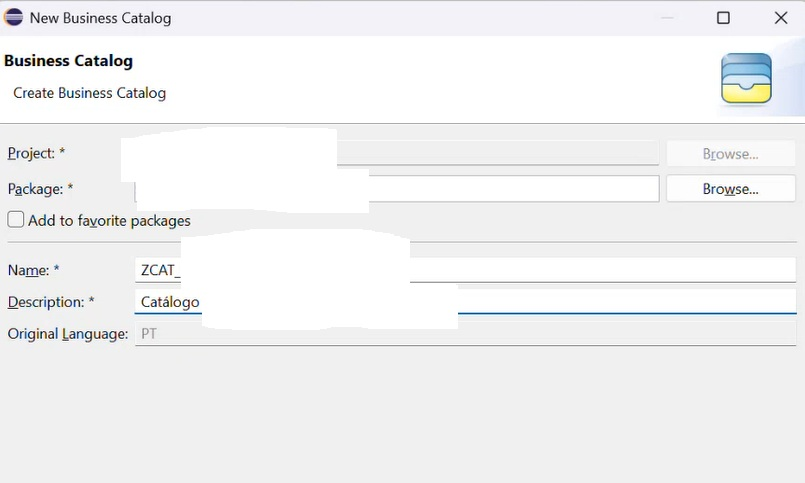

### 18. Vinculando o IAM App ao Business Catalog

Business Catalog: Digitar o nome do Business Catalog criado: ZCAT... ele automaticamente irá preencher o outros nomes.

Ação: Clicar em Next/Finish

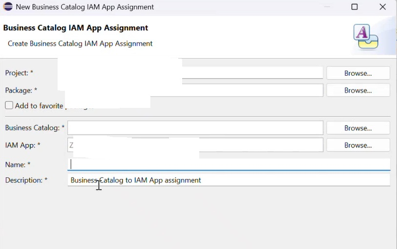

### 19. Criando o Business Role Template

No contexto SAP, um Business Role Template é um modelo pré-configurado de uma função de negócio, fornecido normalmente pela SAP, que reúne os acessos necessários para um determinado perfil de usuário.

Resumindo:
Business Role Template = modelo de uma Business Role que você pode usar como base para criar/configurar uma função de negócio.

Name: ZBR_NOME_APP

Description: Descrição do App.

Ação: Clicar em Next/Finish

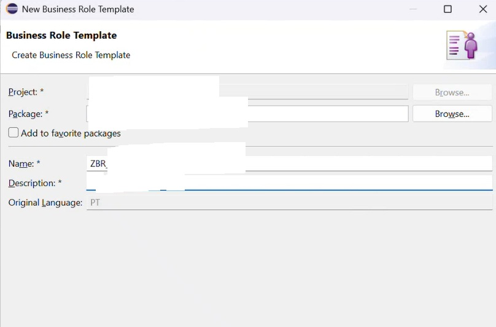

### 20. Configurando o Business Role template

Ação: Clicar em Add e adicionar o Business Catalog criado anteriormente. Ex: ZCAT...

Ação: Clicar em Next/Finish

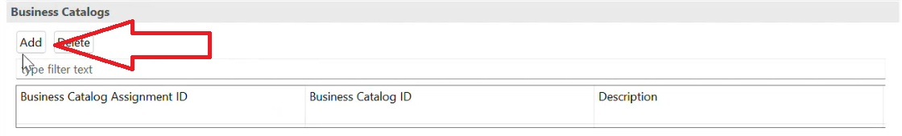

### 21. Criando Launchpad Page Template

No contexto do SAP Fiori Launchpad, um Launchpad Page Template é um modelo de página que define como os aplicativos são organizados e apresentados no Launchpad.

Resumindo:
Launchpad Page Template = modelo de estrutura/layout de uma página do Fiori Launchpad.

Name: ZPG_NOME_PAGINA

Description: Página de...

TitleinLaunchpad: Configurações

Ação: Clicar em Next/Finish

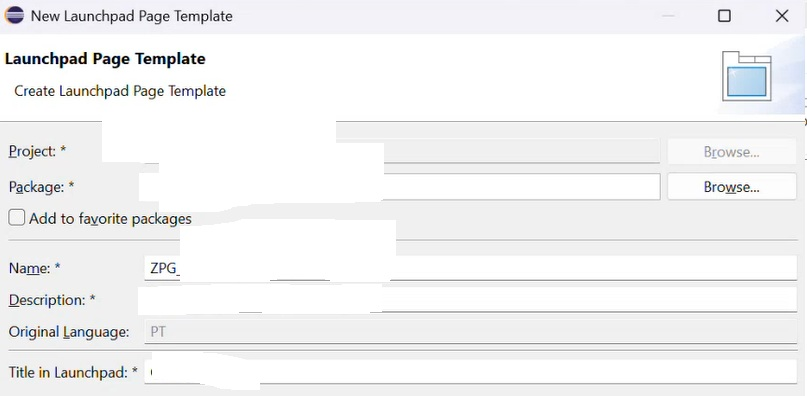

### 22. Configurando o Launchpad Page Template

Clicando em Add será criada uma section como mostra na imagem

Clicando com o botao direito encima de Visualizations será possivel adicionar clicando em "Add Visualizations".

No canto inferior direito no campo : Launchpad App Descriptor Item ID colocar o nome do Descriptor

Ex: ZDSC_...

Ação: Clicar em Ativar

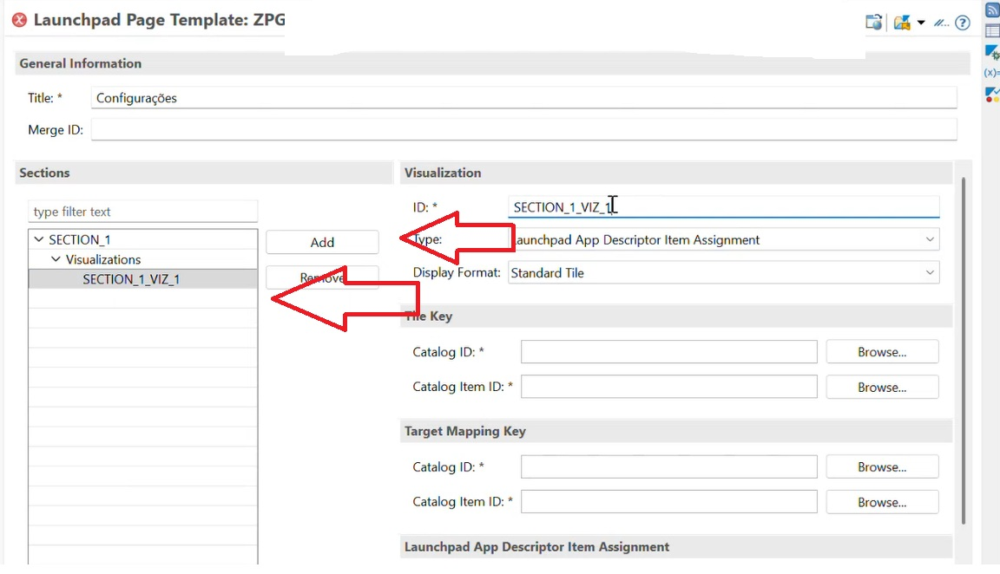

### 23. Criando o Space Template

No SAP Fiori Launchpad, um Launchpad Space Template é um modelo que define a estrutura de navegação de um espaço .

Resumindo:
Space Template = modelo que define quais páginas e seções estarão disponíveis dentro de um espaço do Launchpad.

Name: ZSP_NOME_APP

Description: Espaço nomedoapp

Title: Titulo do Aplicativo

Ação: Clicar em Next/Finish

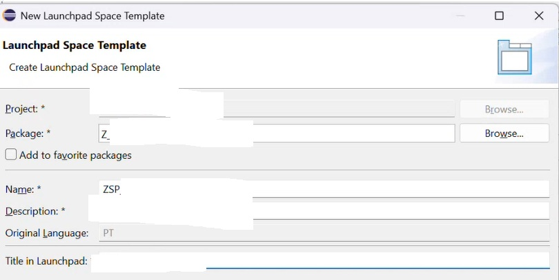

### 24. Configurando o Space Template

Clicando em Add será possivel colocar a nossa página no campo Name: ZPG_...

Ação: Clicar em Add/ Salvar e Ativar

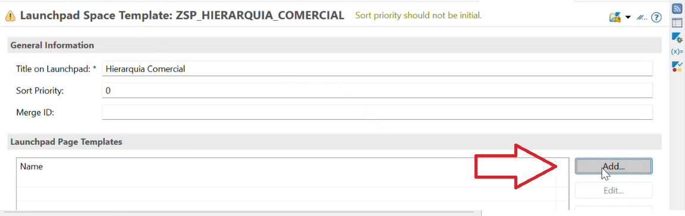

### 25. Criando Business Role template-. Launchpad Space Templ. Assignment

Name: ZSP_...

Description: Vínculo...

Ação: Clicar em Next../Finish

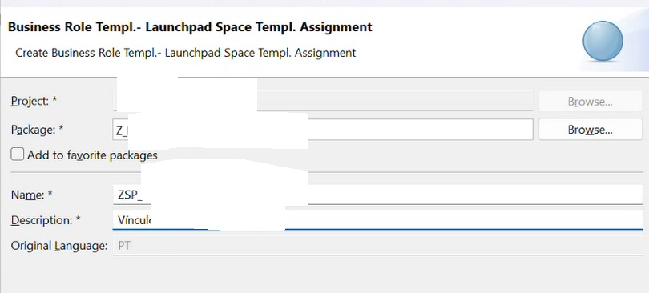

### 26. Configurando o Vínculo Business Role template-. Launchpad Space Templ. Assignment

Business Role Template: Nome da Business ROLE - ZBR_...

Launchpad Space Tempalte: Nome do Space Template - ZSP_...

Ação: Clicar em Next../Finish

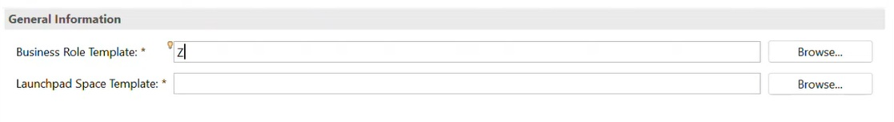